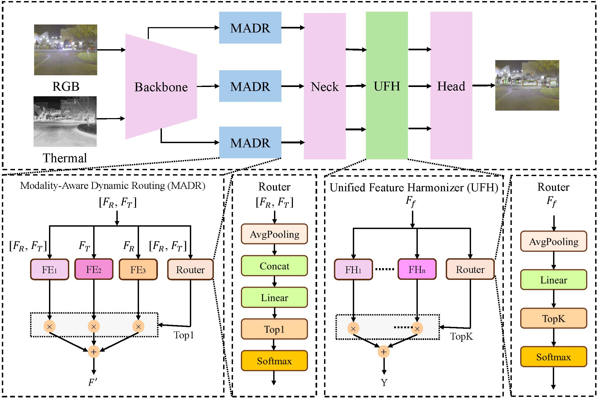
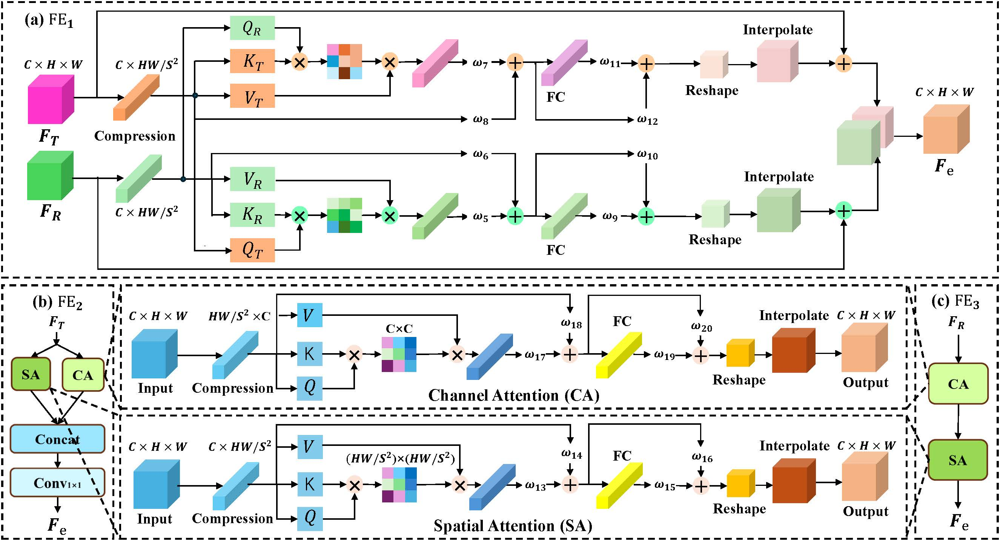

## <div align="center">DRNet: Dynamic Routing for Robust Multispectral Object Detection under Modality Missing</div>

### Introduction
We propose a Dynamic Routing-based Multispectral Object Detection Network (DRNet), which is evaluated on the FLIR, KAIST, and LLVIP datasets. To address the issue of modality missing in RGB-T networks, DRNet introduces modality awareness and dynamic adaptation mechanisms. The network incorporates a Modality-Aware Dynamic Routing (MADR) module, which adaptively routes features between multimodal fusion and unimodal enhancement pathways to reduce the impact of missing modalities. Furthermore, we propose a Unified Feature Harmonize (UFH) module that equips a shared detection head with modality-aware transformations, allowing it to adapt to fused, RGB-only, and thermal-only inputs by capturing modality-specific feature distributions, thereby improving cross-modal robustness. In our implementation, Dynamic Feature Ehancement (DFE)  module and Dynamic Feature Mapping (DFM) module correspond to the concepts MADR and UFH introduced in the paper.

### Overview
<div align="center">
  
  <div style="color:orange; border-bottom: 10px solid #d9d9d9; display: inline-block; color: #999; padding: 10px;"> Fig 1. Overview of DRNet framework. </div>
</div>

<div align="center">
  
  <div style="color:orange; border-bottom: 10px solid #d9d9d9; display: inline-block; color: #999; padding: 10px;"> Fig 2. Illustration of the feature enhancement modules of MADR module corresponding to FE1, FE2, FE3 in Fig 1. </div>
</div>

### Installation
We use "conda create --name DRNet python=3.8" to create a environment and install the dependencies in requirements.txt. 

### Datasets
The datasets encompass samples for both training and testing, covering scenarios with complete modalities and those with missing modalities.

- **KAIST**  
Link：https://pan.baidu.com/s/1DY7YkLm0yvO-0osv04m9zg 
Code：axui 

 - **FLIR**  
Link：https://pan.baidu.com/s/1xkdnuPpRwSabuxYmQaT9Ig
Code: kiah 

- **LLVIP** 
Link: https://pan.baidu.com/s/1JzzfX-S5X0zQcP7KWWfyhQ 
Code: emjy

- Download the training datasets to your disk, the organized directory should look like:
```
    --datasetname:
    	|--infrared
         |--train
         |--test
      |--labels
         |--train
         |--test
      |--visible
         |--train
         |--test
      |--qualities
         |--train
         |--test
      |--corruption
         |--dual_modalilty
            |--ir_rgb_5
            |--ir_rgb_10
            |--ir_rgb_15
            |--ir_rgb_25
            |--ir_rgb_35
            |--ir_rgb_45
            |--ir_rgb_50
            |--ir_zero_100
            |--rgb_zero_100
            |--day_rgb_missing
            |--night_ir_missing
  ```
  
  Edit the paths in `./data/multispectral/FLIR.yaml`，  `./data/multispectral/kaist.yaml`, `./data/multispectral/LLVIP.yaml`  to the proper ones.


### Training and Test
To train and test the model, simply run train.py and test.py respectively. The program was developed and run in a PyCharm environment on a computer with the Windows 10 operating system.

### Evalutaion Result

<div align="center">  Table 1.  Evaluation results on the FLIR dataset and its corrupted variants.  </div>
 “`markdown
| 0:0  | 100:0 | 0:100 |
| :--- | :---: | :---: |
| 82.2 | 62.5  | 80.4  |
“`


# Files
**Note**: This is the txt files for evaluation. We continuously optimize our codes, which results in the difference in detection performance. However, the codes of module for multimodal object detection still remain consistent with the methods proposed in this paper.


